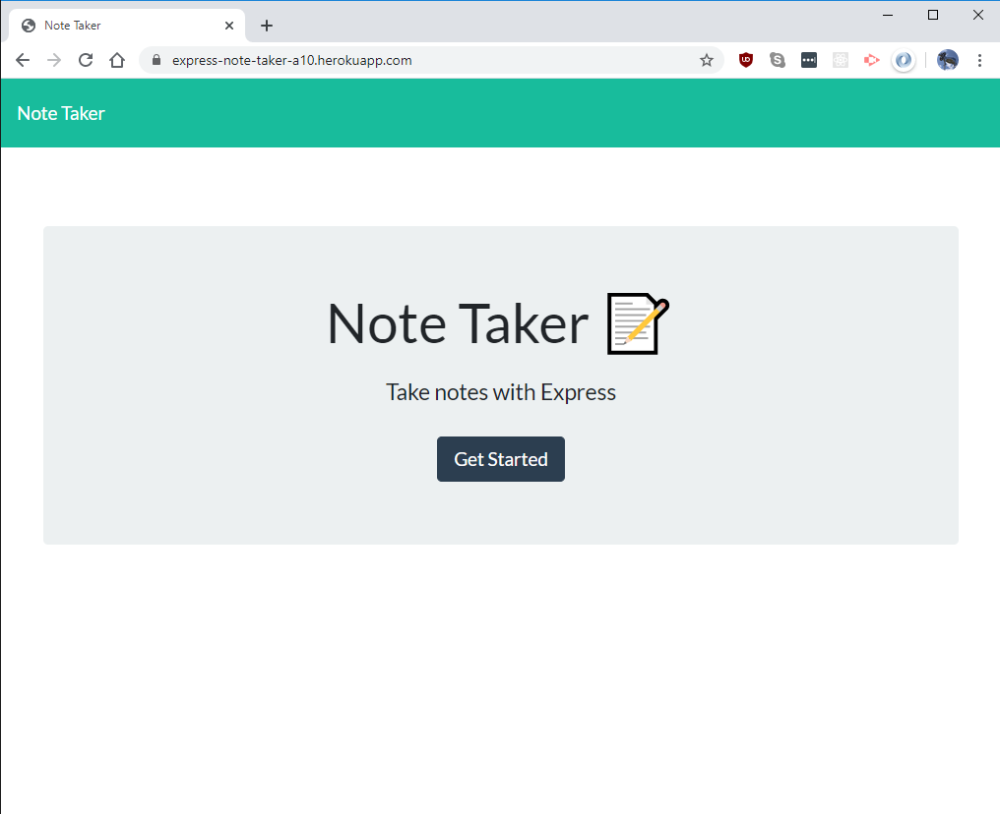
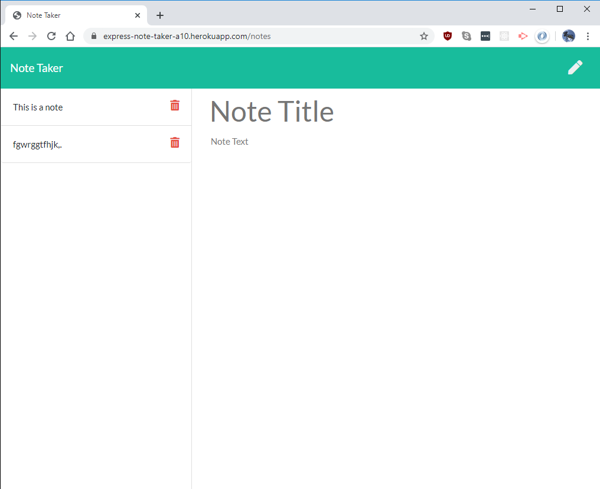

# Assignment 10: Note Taker

## Note taking webapp built using Express and Node

The app is hosted on Heroku with logic and data stored server-side.

The user can take notes with a title and body text. Saved notes are displayed on the left and can be deleted.

## Live site: https://express-note-taker-a10.herokuapp.com
